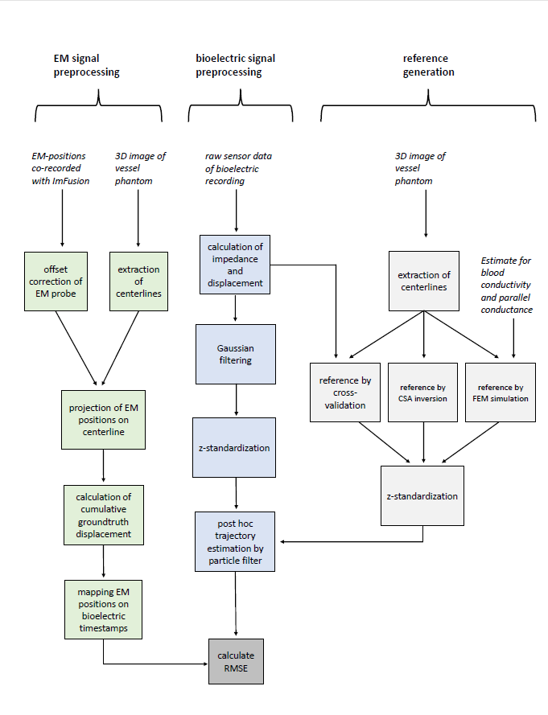

# data analysis scripts BA
Data analysis scripts used for the Bachelor Thesis "A Particle Filter Approach to Bioelectric Catheter Localization"

## preprocessing pipeline

## post-hoc analysis of in-vitro recorded catheter runs

## statistical analysis